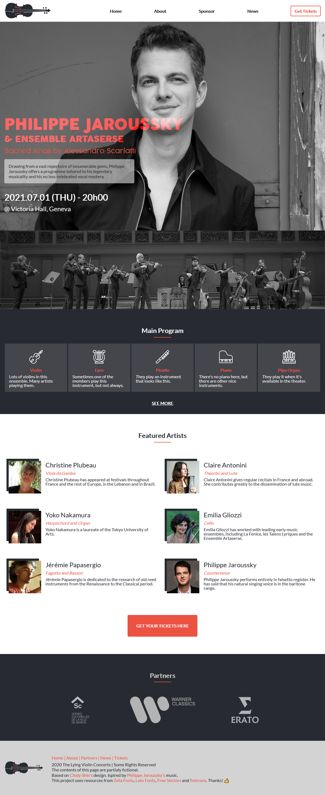

# Project Name

> A webpage for a *somewhat fictional* concert of the artist Philippe Jaroussky, based on [Cindy Shin's concept](https://www.behance.net/gallery/29845175/CC-Global-Summit-2015).

<!-- 
 
 

-->

 
 

## This is my first Capstone project for the Microverse program
- It consists of a web page for a concert based on a concept design;
- It has three pages;
- It's responsive and has optimized versions for two sizes:
    - mobile: up to 768px;
    - desktop: from 768px;
- It folows the colors, typographies and layout of the given design.

## Built With

- HTML
- CSS

## Live Demo

[Here's a link to a live demo](https://brenoxav.github.io/philippe-jaroussky-concert/)

## Author

👨‍💻 **Breno Xavier**

- GitHub: [@brenoxav](https://github.com/brenoxav)
- Twitter: [@brenoxav](https://twitter.com/brenoxav)
- LinkedIn: [Breno Xavier](https://linkedin.com/in/brenoxav)

## Show your support

Give a ⭐️ if you like this project!

## Acknowledgments

- [Cindy Shin](https://www.behance.net/adagio07) for the design project;
- [Philippe Jaroussky](http://www.philippejaroussky.fr/): The artist who served as inpiration for this project's theme;
- I've made use of resources from:
    - [Zeta Fonts](http://www.zetafonts.com/cocogoose) (typography)
    - [Lato Fonts](https://www.latofonts.com/) (typography)
    - [Free Vector](https://www.freevector.com/) (icons)
    - [flaticon](https://www.flaticon.com/) (icons)

## 📝 License

This project is [MIT](LICENSE) licensed.